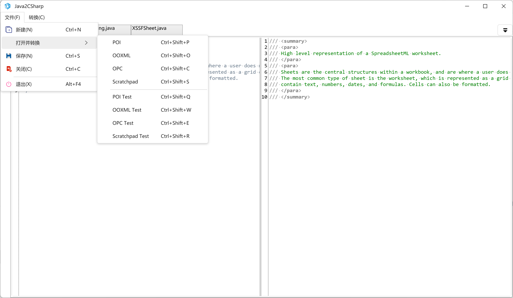

# 简介

该工具是一个将POI Java代码转换成C#代码的转换器。基于项目[Java2CSharp](https://github.com/javaparser/javaparser)改进而来，提供了一个WPF界面。

## 使用说明

在使用该工具之前，需要配置POI项目和NPOI项目的目录。配置信息存放在`config.xml`文件中。

在文件中找到如下节点：
```xml
<folder name="base" source="D:\work\poi\poi.git" target="D:\work\npoi\"></folder>
```

将`source`节点的目录修改为POI项目的目录，将`target`节点的目录修改为NPOI项目的目录。

 使用时可以快速定位到POI项目对应的目录。

 

 保存文件(`Ctrl+S`)将会根据POI文件的路径，把转换结果保存到NPOI对应的目录下。如果文件已存在，工具不会覆盖文件，而是另存一个文件。

 该工具还提供了将java风格的注释转换成C#风格的注释的功能。